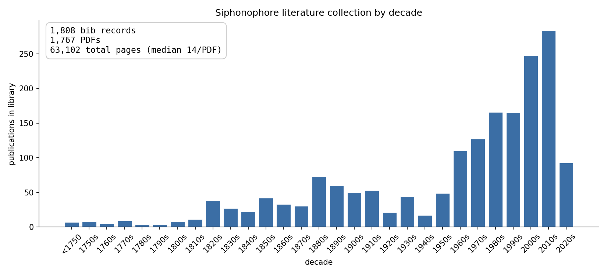

# Siphonophores

This is a collection of siphonophore manuscripts. The vast majority were painstakingly curated by Phil Pugh. He made high-quality scans of many of the older papers, and curated metadata.

<!-- BEGIN: stats (autogen by scripts/validate_bib.py --emit-readme) -->


**1,761 PDFs · 1,802 bib records · 62,996 total pages** (mean 36 pages/PDF, median 14)
<!-- END: stats -->

## Cloning

The PDFs in this repo are stored in [Git LFS](https://git-lfs.github.com).
Without LFS installed, `git clone` will fetch only ~135-byte pointer files
in place of the actual PDFs.

One-time setup (per machine):

```bash
brew install git-lfs        # macOS; or apt/dnf/etc. on Linux
git lfs install             # wires the LFS filter into your git config
```

Then clone normally — git will hydrate the LFS pointers as it checks out:

```bash
git clone https://github.com/dunnlab/siphonophores.git
```

If you cloned *before* installing LFS, run `git lfs pull` inside the
existing checkout to swap the pointer files for the real PDFs.

## Repo contents

### Primary materials

These are the contents most readers will use.

Siphonophore Library PDFs sit under `library/`, sharded by surname-letter shelves (`library/A`, `library/B`, …). One subdirectory is special:

- `library/orphans/` — PDFs we want to keep but for which we have no known
  bibliographic information. They're intentionally not referenced from
  `siphonophores.bib` and are skipped by the curation scripts.

[`siphonophores.bib`](siphonophores.bib) contains reference data for all these PDFs. This document should be kept up to date with repo contents.

[`instructions.md`](instructions.md) holds clade-specific knowledge to be injected into the context of an MCP server serving this corpus — facts about siphonophore taxonomy and biology that should override or qualify what the older literature in `library/` says.

### Other materials

`nonlibrary/` contains PDFs that fall outside of the core library, including:

- `Pugh non siphonophore papers/` (at the repo root, not under `library/`)
  holds non-siphonophore PDFs Pugh kept alongside the main collection (e.g.
  methods/oceanographic-context papers cited from his work). These are not
  part of `siphonophores.bib` and are excluded from reconciliation.
- `translations/` (also at the repo root) holds translations of papers in
  the main library — companion files to bib entries rather than primary
  records of their own. Excluded from reconciliation.
- `others/` (at the repo root) holds alternate scans, plate-only excerpts,
  and other miscellaneous PDFs that supplement entries in the main library
  without being the primary record. Excluded from reconciliation.

Phil's original reference list is preserved here as `archive/AASCANNED LITERATURE.docx`. This is an artefact for provenance; do not update it.

`scripts/` contains two categories of scripts:

- Scripts used to validate and summarize the library. These should be run when new records are added.
- Those that were used to generate `siphonophores.bib` from `archive/AASCANNED LITERATURE.docx` and then fully reconcile it to `library/`. Those scripts will not need to be run again and are preserved here for provenance.

[`CONTRIBUTING.md`](CONTRIBUTING.md) documents the scripts, with a focus on the initial generation of `siphonophores.bib`.

## Adding a PDF

Send any PDFs you would like to add to Casey Dunn or post a link in the issue tracker.

Casey's process for adding PDFs:

1. Rename PDF according to conventions, place in the appropriate `library/` directory.
2. Add entry to `siphonophores.bib`.
3. Validate `siphonophores.bib` with:

```bash
# Fast checks (bib well-formedness, key/DOI/file/URL coverage, inventory gaps):
python scripts/validate_bib.py

# Add --scan-pdfs for content-level checks (md5 dedup, page counts, corruption);
# adds ~6s on this corpus:
python scripts/validate_bib.py --scan-pdfs

# Once everything is passing, regenerate the headline stats and histogram in
# this readme (implies --scan-pdfs):
python scripts/validate_bib.py --emit-readme
```