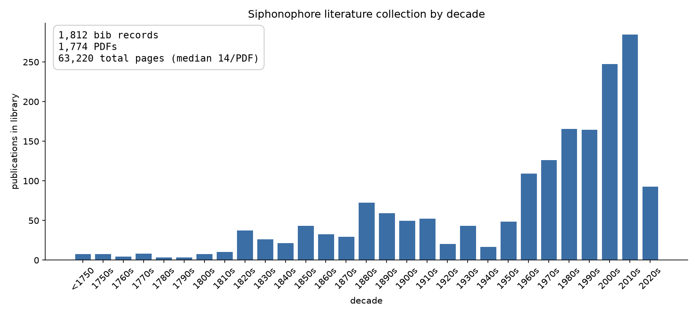

# Siphonophores

This is a collection of siphonophore manuscripts. The vast majority were painstakingly curated by Phil Pugh. He made high-quality scans of many of the older papers, and curated metadata.

<!-- BEGIN: stats (autogen by scripts/validate_bib.py --emit-readme) -->


**1,774 PDFs · 1,812 bib records · 63,220 total pages** (mean 36 pages/PDF, median 14)
<!-- END: stats -->

## Cloning

The PDFs in this repo are stored in [Git LFS](https://git-lfs.github.com).
Without LFS installed, `git clone` will fetch only ~135-byte pointer files
in place of the actual PDFs.

One-time setup (per machine):

```bash
brew install git-lfs        # macOS; or apt/dnf/etc. on Linux
git lfs install             # wires the LFS filter into your git config
```

Then clone normally — git will hydrate the LFS pointers as it checks out:

```bash
git clone https://github.com/dunnlab/siphonophores.git
```

If you cloned *before* installing LFS, run `git lfs pull` inside the
existing checkout to swap the pointer files for the real PDFs.

## Repo contents

### Primary materials

These are the contents most readers will use.

Siphonophore Library PDFs sit under `library/`, sharded by surname-letter shelves (`library/A`, `library/B`, …). One subdirectory is special:

- `library/orphans/` — PDFs we want to keep but for which we have no known
  bibliographic information. They're intentionally not referenced from
  `siphonophores.bib` and are skipped by the curation scripts.

[`siphonophores.bib`](siphonophores.bib) contains reference data for all these PDFs. This document should be kept up to date with repo contents. Source-checked corrections and remaining review items are recorded in [`CURATION_NOTES.md`](CURATION_NOTES.md).

[`instructions.md`](instructions.md) holds clade-specific knowledge to be injected into the context of an MCP server serving this corpus — facts about siphonophore taxonomy and biology that should override or qualify what the older literature in `library/` says.

[`transcriptions/`](transcriptions) holds verbatim, page-by-page transcriptions of documents in the library, one directory per document — currently **35 documents, 761 pages**, spanning 1594–2026 and 13 languages. They were made by reading rendered page images only, never by correcting a PDF text layer, which is what lets them serve as ground truth for evaluating text extraction. Each `<stem>/` maps to its source PDF through `transcriptions/sources.json`. See [`transcriptions/readme.md`](transcriptions/readme.md) for the method, the independence guarantee, and known gaps.

### Other materials

`nonlibrary/` contains PDFs that fall outside of the core library, including:

- `Pugh non siphonophore papers/` (at the repo root, not under `library/`)
  holds non-siphonophore PDFs Pugh kept alongside the main collection (e.g.
  methods/oceanographic-context papers cited from his work). These are not
  part of `siphonophores.bib` and are excluded from reconciliation.
- `translations/` (also at the repo root) holds translations of papers in
  the main library — companion files to bib entries rather than primary
  records of their own. Excluded from reconciliation.
- `others/` (at the repo root) holds alternate scans, plate-only excerpts,
  and other miscellaneous PDFs that supplement entries in the main library
  without being the primary record. Excluded from reconciliation.

Phil's original reference list is preserved here as `archive/AASCANNED LITERATURE.docx`. This is an artefact for provenance; do not update it.

`scripts/` contains three categories of scripts:

- Scripts used to validate and summarize the library. These should be run when new records are added.
- Scripts used to curate per-document annotations — see [Page annotations](#page-annotations) below.
- Those that were used to generate `siphonophores.bib` from `archive/AASCANNED LITERATURE.docx` and then fully reconcile it to `library/`. Those scripts will not need to be run again and are preserved here for provenance.

[`CONTRIBUTING.md`](CONTRIBUTING.md) documents the scripts, with a focus on the initial generation of `siphonophores.bib`.

## Page annotations

A PDF in this library is often not just the paper. Library and vendor wrappers
(BHL, JSTOR, Google Books, ResearchGate), bound-in journal title pages, appended
or interleaved English translations, and blank runs all share the file with the
work the bib entry describes. Left alone they skew OCR language detection, waste
OCR time, and turn copyright notices into searchable text.

Three optional bib fields record what is actually in each file:

| field | meaning |
|---|---|
| `keeppages` | physical, 1-based PDF pages that are the paper — `3--20`, `2,4,8--20`, `40--` |
| `doclang` | language(s) of those pages as BCP-47 tags, comma-separated with the dominant language first — `ru`, `fr`, `de-Latf`, `grc`, `es, en` |
| `ocrlang` | Tesseract packs, **derived** from `doclang`; do not hand-edit |
| `pagemap` | free-text description of the document's structure; documentation only |

`keeppages` is physical page positions, never the printed `pages` range — for an
offprint the two are wildly different numbers.

The workflow:

The scripts need `pymupdf` (and `pillow` for contact sheets). Both are declared
in `environment.yaml`; an environment created before that needs
`conda env update -f environment.yaml`.

```bash
# 1. Measure. Writes build/page_evidence.json (~16 MB, gitignored).
python scripts/inspect_pages.py

# Look at one document instead of the whole library:
python scripts/inspect_pages.py --pdf Ilyin1900.pdf

# Render it as contact sheets, 20 pages per grayscale JPEG, for documents
# where the text layer cannot answer the question:
python scripts/inspect_pages.py --pdf Ilyin1900.pdf --sheets

# 2. Annotate, following prompts/annotate_pages.md, into
#    build/page_annotations.json.

# 3. Apply. Always dry-run first and read the diff.
python scripts/apply_page_annotations.py --dry-run
python scripts/apply_page_annotations.py
git diff siphonophores.bib

# Audit ocrlang against doclang at any time:
python scripts/apply_page_annotations.py --check
```

`tests/fixtures/page_annotations.groundtruth.json` holds hand-checked
annotations for ten documents spanning the awkward cases (BHL and JSTOR
wrappers, Google Books boilerplate, appended and interleaved translations, a
translation with no original, a born-digital paper). Use it to check the
pipeline end to end before trusting a bulk run.

`scripts/bibio.py` underlies step 3: it edits entries by byte span, so entries
nobody touched are written back unchanged and the diff is only the added lines.
`python scripts/bibio.py --selftest` verifies that on the live bib.

Two things worth knowing before annotating:

- **An empty `review_reasons` is not a clean bill of health.** The reasons come
  from page measurements only. Translation-suffixed filenames, Fraktur typesetting
  and publication age are invisible to them and have to be checked separately —
  the prompt says where.
- **An empty text layer does not mean an empty page.** A page with zero
  characters may be a blank sheet or the whole article as a bitmap. The
  evidence file's `kind` column distinguishes them by asking the raster layer.
  `Bennett1860.pdf` has 21 consecutive zero-character pages and every one is the
  paper.
- **Publisher branding is not front matter.** Springer, ScienceDirect and Wiley
  strings are printed on the article's own first page; dropping that page
  because it carries one removes the paper's opening.

These fields are read by the [corpus](https://github.com/caseywdunn/corpus)
pipeline. `keeppages` support is tracked in corpus#188 and is not yet
implemented, so annotations recorded now sit inert until it lands.

## Adding a PDF

Send any PDFs you would like to add to Casey Dunn or post a link in the issue tracker.

Casey's process for adding PDFs:

1. Rename PDF according to conventions, place in the appropriate `library/` directory.
2. Add entry to `siphonophores.bib`.
3. Validate `siphonophores.bib` with:

```bash
# Fast checks (bib well-formedness, key/DOI/file/URL coverage, inventory gaps):
python scripts/validate_bib.py

# Add --scan-pdfs for content-level checks (md5 dedup, page counts, corruption);
# adds ~6s on this corpus:
python scripts/validate_bib.py --scan-pdfs

# Once everything is passing, regenerate the headline stats and histogram in
# this readme (implies --scan-pdfs):
python scripts/validate_bib.py --emit-readme
```